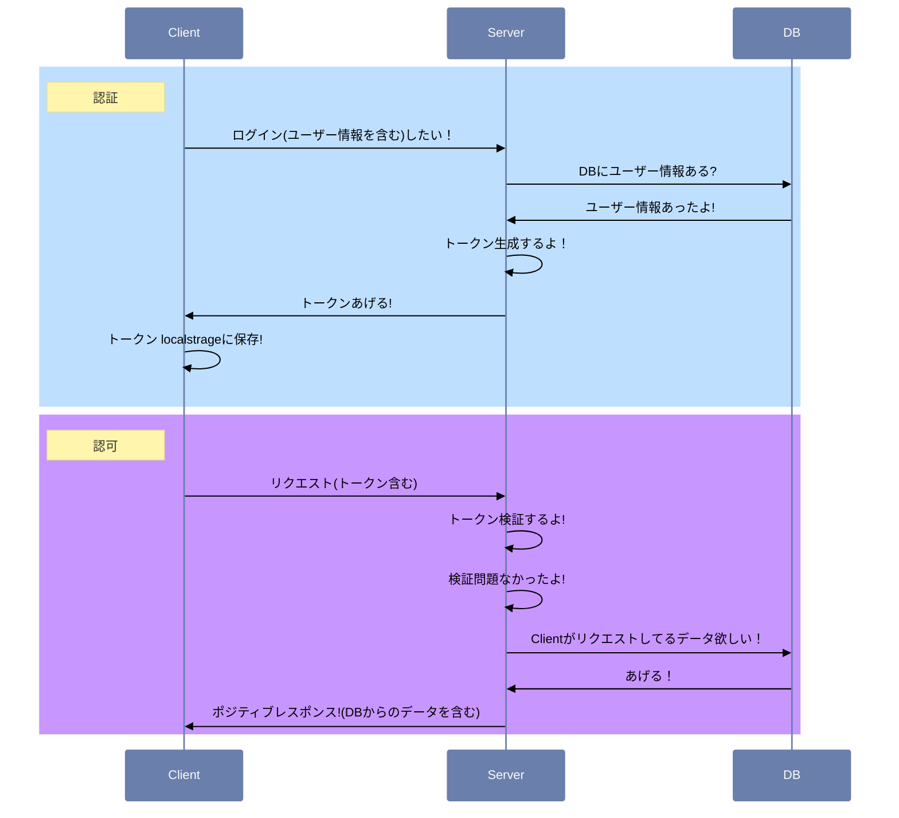

```mermaid
sequenceDiagram
%%{init:{'theme':'base','themeVariables':{'primaryColor':'#6A7FAB','primaryTextColor':'#FAFBF9','primaryBorderColor':'#6A7FAB','lineColor':'#6A7FABCC','textColor':'#000000','fontSize':'20px'}}}%%

    participant Client
    participant Server
    participant DB
    
    rect rgb(191, 223, 255)
    note left of Client: 認証
        Client->>Server: ログイン(ユーザー情報を含む)したい！
        Server->>DB: DBにユーザー情報ある?
        DB->>Server: ユーザー情報あったよ!
        Server->>Server: トークン生成するよ！
        Server->>Client: トークンあげる!
        Client->>Client: トークン localstrageに保存!
    end

    rect rgb(200, 150, 255)
    note left of Client: 認可
        Client->>Server: リクエスト(トークン含む)
        Server->>Server: トークン検証するよ!
        Server->>Server: 検証問題なかったよ!
        Server->>DB: Clientがリクエストしてるデータ欲しい！
        DB->>Server: あげる！
        Server->>Client: ポジティブレスポンス!(DBからのデータを含む)
    end

```