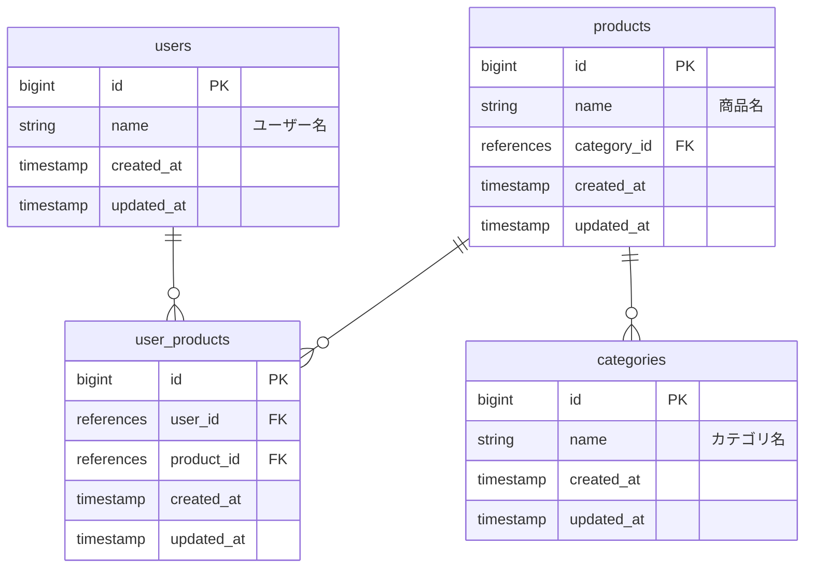

```mermaid
erDiagram
  users ||--o{ user_products : ""
  products ||--o{ user_products : ""
  products ||--o{ categories : ""
  users {
    bigint id PK
    string name "ユーザー名"
    timestamp created_at
    timestamp updated_at
  }

  products {
    bigint id PK
    string name "商品名"
    references category_id FK 
    timestamp created_at
    timestamp updated_at
  }

  categories {
    bigint id PK
    string name "カテゴリ名"
    timestamp created_at
    timestamp updated_at
  }

  user_products {
    bigint id PK
    references user_id FK 
    references product_id FK 
    timestamp created_at
    timestamp updated_at
  }
```