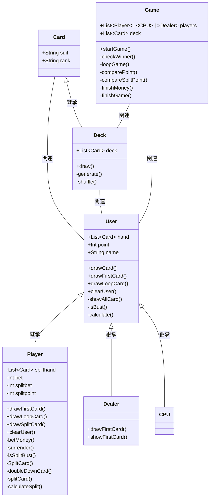

## BlackJack
## ゲームルール
ブラックジャックはカジノで行われるカードゲームの一種です。1〜13までの数が書かれたカード52枚を使ってゲームが行われます。ルールは次の通りです。
- 実行開始時、ディーラーとプレイヤー全員に２枚ずつカードが配られる
- プレイヤーは2枚ずつ配られたタイミングでサレンダーするか選択できる(掛け金が0.5倍になって返ってくる)
- 自分のカードの合計値が21に近づくよう、カードを追加するか、追加しないかを決める
- カードの合計値が21を超えてしまった時点で、その場で負けが確定する
- プレイヤーはカードの合計値が21を超えない限り、好きなだけカードを追加できる
- ディーラー、CPUはカードの合計値が17を超えるまでカードを追加する
- 最大3人までのプレイヤーでプレイ可能です。(プレイ開始時に何人でプレイするか選択可能)
- プレイヤーは所持金1000から開始する
- プレイヤーはサレンダー、ダブルダウン、スプリットを実行可能
  
各カードの点数は次のように決まっています。
- Aは1点あるいは11点として、合計値が21以内で最大となる方で数える
- 2から10までは、書かれている数の通りの点数。J,Q,Kは10点

## 実行例
```bash
$ ruby Game.rb
CPUを何人追加しますか?(0~3を入力してください)
$ 2
いくらベットしますか。現在の所持金:1000
$ 500
500をベットします。現在の所持金:500
Playerが引いたカードは♣︎Kです。
Playerが引いたカードは♦︎5です。
Playerの現在のポイントは15です。
ダブルダウンしますか？yまたはnを入力してください
$ n
サレンダーしますか？yまたはnを入力してください
$ n
Playerの現在のポイントは15です。カードを引きますか？
yまたはnを入力してください
$ y
Playerの現在のポイントは20です。カードを引きますか？
yまたはnを入力してください
$ n
Playerの現在のポイント : 20

CPU1が引いたカードは♦︎Qです。
CPU1が引いたカードは❤︎2です。
CPU1の現在のポイントは12です。
CPU1バーストしました。
CPU1の現在のポイント : 22

CPU2が引いたカードは♣︎5です。
CPU2が引いたカードは♣︎2です。
CPU2の現在のポイントは7です。
CPU2の現在のポイント : 18

Dealerが引いたカードは♠︎4です。
Dealerの2枚目のカードはわかりません。
Dealerバーストしました。
Dealerの現在のポイント : 26

Playerの勝ちです
現在の所持金:1500

CPU1の勝ちです

CPU2の勝ちです

ゲームを終了しますか?yまたはnを入力してください
$ y
ゲームを終了します
```

## クラス図


## ファイル構成
```bash
BlackJack
├── Game.rb            #実行クラス。各クラスを呼びゲーム開始から終了まで処理を担当
├── Card.rb            #カードクラス
├── Deck.rb            #カードクラスを継承したデッキクラス
├── User.rb            #ユーザークラス
├── Player.rb          #ユーザークラスを継承するプレイヤークラス
├── CPU.rb             #ユーザークラスを継承するCPUクラス。複数人プレイする場合のプレイヤー用
├── Dealer.rb          #ユーザークラスを継承するディーラークラス
└── README.md          #本ゲームの説明
```
## 実行環境
- Ruby 2.7.3
- zsh 5.8